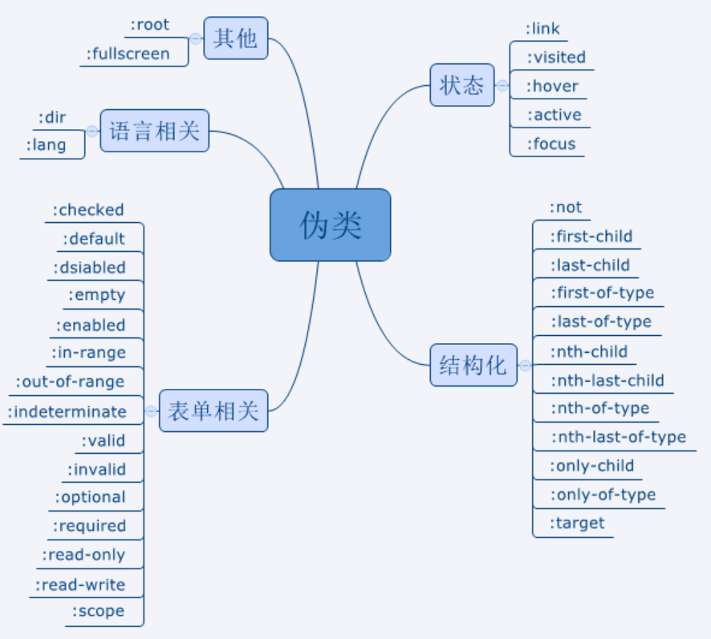

# 区别
 > 伪类：伪类对元素的分类是基于特征，而不是基于元素的名字属性或是内容。特征并不可以通过DOM树直接获得。
 >（伪类选择器就是不存在与HTML文档中，但是用CSS语法可以选择它们，并对其能够渲染修饰）

 >伪元素：伪元素创造文档语言能够指定的文档树之外的抽象。例如：first-chlid访问第一个子元素。
 >（CSS伪元素用于向某些选择器设置特殊效果）
+ css3语法中 伪类使用(:) 伪元素使用(::) 加以区分
 > 注意：如果网站只需要兼容Webkit 、Firefox、Opera等浏览器或是移动端页面，建议伪元素选择器使用两个冒号（::）的写法；
 > 如果一定要兼容低版本的IE浏览器时，还是使用CSS2的单个冒号（:）的写法更加保险一些网站 

# 常见的种类
+ 1、动态伪类选择器(不存在与HTML中，只有在动态交互时才使用)
 + ：active  选择所有有效值的属性
 + ：link  选择所有未访问链接
 + ：hover  把鼠标放在链接上的状态
 + ：visited  选择正在活动链接
 + ：lang  指定 lang 属性开始的元素添加样式
 + ：focus  选择元素输入后具有焦点

+ 2、UI元素状态伪类选择器(元素分为不同的状态，常用于表单之中)
 + ：disable   指定当页面打开时默认处于选取状态的单选框或复选框的控件的样式
 + ：cehcked   指定当表单中的radio单选框或者是checkbox复选框处于选取状态时的样式
>还有更多选择器，感兴趣可以自己去查询一下~

+ 3、结构伪类选择器：(很大程度上简化了HTML的的文本结构，让HTML更语义化更结构化。减少了文档中class和id的使用。)
 + ：first-child  选择第一个子元素
 + ：last-child  选择元素最后一个子元素
 + ：nth-child()  选择某元素一个或是多个特定的子元素
 + ：nth-last-child() 选择某个元素一个或是多个特定的子元素，从这个子元素的最后一个子元素开始计算
 + ：nth-of-type() 选择指定的元素
 + ：nth-last-of-type() 选择指定元素，从元素最后一个值开始计算
 + ：first-of-type   选择一个上级元素下的第一个同类子元素
 + ：last-of-type  选择一个上级元素下的最后一个同类子元素
 + ：only-child  选择父元素的唯一一个子元素
 + ：only-of-type  选择一个元素是它上级元素的唯一一个相同类型的子元素
 + ：empty   选择的元素里面没有任何内容

+ 常见伪元素的种类：
 + ::first-letter  将特殊的样式添加到文本的首字母
 + ::first-line  将特殊的样式添加到文本的首行
 + ::before  在某元素之前插入某些内容
 + ::after  在某元素之后插入内容
 + ::selection  匹配元素中被用户选中或处于高亮状态的部分
 + ::backdrop  给下层文档设置样式或隐藏它
 
